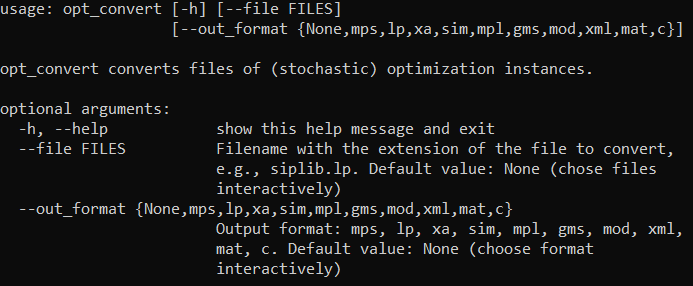

[![Contributors][contributors-shield]][contributors-url]
[![Forks][forks-shield]][forks-url]
[![Stargazers][stars-shield]][stars-url]
[![Issues][issues-shield]][issues-url]
[![MIT License][license-shield]][license-url]
[![LinkedIn][linkedin-shield]][linkedin-url]


<!-- PROJECT LOGO -->
<br />
<p align="center">
  <a href="https://github.com/pashtetgp/opt_convert">
    
  </a>
</p>

  <h3 align="center">OPT_CONVERT</h3>

  <p align="center">
    The Python package and command line utility for transforming mathematical optimization models defined in .mpl, .lp, .mps file formats to .mps, .lp, .xa, .mpl, .mod and other formats.
    <br />
    <a href="https://github.com/pashtetgp/opt_convert"><strong>Explore the docs »</strong></a>
    <br />
    <br />
    <!-- <a href="https://github.com/pashtetgp/opt_convert">View Demo</a>
    ·-->
    <a href="https://github.com/pashtetgp/opt_convert/issues">Report Bug</a>
    ·
    <a href="https://github.com/pashtetgp/opt_convert/issues">Request Feature</a>
  </p>


<!-- TABLE OF CONTENTS -->
## Table of Contents

* [About the Project](#about-the-project)
  * [Built With](#built-with)
* [Getting Started](#getting-started)
  * [Prerequisites](#prerequisites)
  * [Installation](#installation)
* [Usage](#usage)
* [Roadmap](#roadmap)
* [Contributing](#contributing)
* [License](#license)
* [Contact](#contact)
* [Acknowledgements](#acknowledgements)


<!-- ABOUT THE PROJECT -->
## About The Project


Everyone who works with mathematical optimization problems knows what pain in the *** it can be 
to convert problems from one file format into another. Often ad-hoc solutions for the specific test set
must be created to read the instances.

This packages provides the unified interface for converting optimization models between popular formats:
* .mps (incl. smps as three files: .cor, .sto, .tim)
* .lp ([CPLEX format](http://lpsolve.sourceforge.net/5.1/CPLEX-format.htm))
* .xa
* .sim
* .mpl
* .gms
* .mod
* .xml
* .mat
* .c


Package can be used as the module in Python or as the command line interface (CLI).

### Built With

* [Python 3.6](https://www.python.org/)
* [OptiMax Component Library](http://www.maximalsoftware.com/optimax/)


<!-- GETTING STARTED -->
## Getting Started

To get a local copy up and running follow these simple steps.

### Prerequisites
* python 3.6
* scipy
* matplotlib
* wxpython
* mplpy

### Installation from PyPI
1. Install scipy, matplotlib and wxpython
    ```
    pip install scipy, matplotlib, wxpython
    ```
   
1. Install mplpy
    1. Download and install the [full/academic](http://www.maximalsoftware.com/distrib) or [student](http://www.maximalsoftware.com/download) version of MPL
    1. Install OptiMax Library. On Windows installation file is located in C:\Mplwin\50\setup\Python

1. Install opt_convert
    ```
    pip install opt-convert
    ```

### Installation from GitHub repo

1. Install scipy, matplotlib and wxpython
    ```
    pip install scipy, matplotlib, wxpython
    ```
   
1. Install mplpy
    1. Download and install the [full/academic](http://www.maximalsoftware.com/distrib) or [student](http://www.maximalsoftware.com/download) version of MPL
    1. Install OptiMax Library. On Windows installation file is located in C:\Mplwin\50\setup\Python
    
1. Clone the repo
    ```
    git clone https://github.com/pashtetgp/opt_convert.git
    ```
   
1. cd to project folder and install the package
    ```
    cd C:\opt_convert
    pip install ..\opt_convert
    ```

## Uninstall

run in command line `pip uninstall opt-convert`

<!-- USAGE EXAMPLES -->
## Usage
### As Python module
See class docstrings for details.
```
from opt_convert import Model
from pathlib import Path

in_file = Path('Dakota_det.mpl')
model = Model(in_file)
print('Solution: ' + str(model.solve()))
out_file = in_file.with_suffix('lp')
model.export(out_file)
```

### Via CLI

Change the directory to the folder with model files and run ```opt_convert```.
One or multiple files can be converted at once.


<!--_For more examples, please refer to the [Documentation](https://example.com)_-->

CLI mode accepts --file and --out_format arguments



<!-- ROADMAP -->
## Roadmap

See the [open issues](https://github.com/pashtetgp/opt_convert/issues) for a list of proposed features (and known issues).


<!-- CONTRIBUTING -->
## Contributing

Any contributions you make are **greatly appreciated**.

1. Fork the Project
2. Create your Feature Branch (`git checkout -b feature/AmazingFeature`)
3. Commit your Changes (`git commit -m 'Add some AmazingFeature'`)
4. Push to the Branch (`git push origin feature/AmazingFeature`)
5. Open a Pull Request


<!-- LICENSE -->
## License

Distributed under the MIT License. See `LICENSE` for more information.


<!-- CONTACT -->
## Contact

Pavlo Glushko

Project Link: [https://github.com/pashtetgp/opt_convert](https://github.com/pashtetgp/opt_convert)


<!-- ACKNOWLEDGEMENTS -->
## Acknowledgements
* Icons by [Freepik](https://www.flaticon.com/de/autoren/freepik) from [www.flaticon.com](https://www.flaticon.com/de/)
* Readme template from [othneildrew](https://github.com/othneildrew/Best-README-Template)


<!-- MARKDOWN LINKS & IMAGES -->
<!-- https://www.markdownguide.org/basic-syntax/#reference-style-links -->
[contributors-shield]: https://img.shields.io/github/contributors/pashtetgp/opt_convert.svg?style=flat-square
[contributors-url]: https://github.com/pashtetgp/opt_convert/graphs/contributors
[forks-shield]: https://img.shields.io/github/forks/pashtetgp/opt_convert.svg?style=flat-square
[forks-url]: https://github.com/pashtetgp/opt_convert/network/members
[stars-shield]: https://img.shields.io/github/stars/pashtetgp/opt_convert.svg?style=flat-square
[stars-url]: https://github.com/pashtetgp/opt_convert/stargazers
[issues-shield]: https://img.shields.io/github/issues/pashtetgp/opt_convert.svg?style=flat-square
[issues-url]: https://github.com/pashtetgp/opt_convert/issues
[license-shield]: https://img.shields.io/github/license/pashtetgp/opt_convert.svg?style=flat-square
[license-url]: https://github.com/pashtetgp/opt_convert/blob/master/LICENSE.txt
[linkedin-shield]: https://img.shields.io/badge/-LinkedIn-black.svg?style=flat-square&logo=linkedin&colorB=555
[linkedin-url]: https://linkedin.com/in/pavloglushko